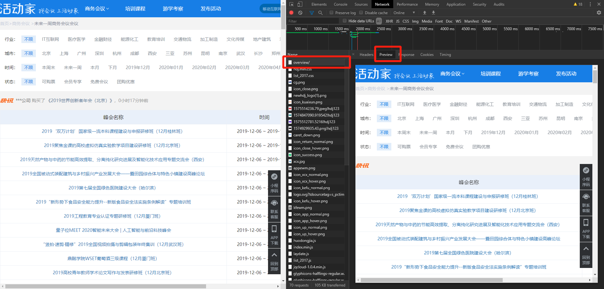
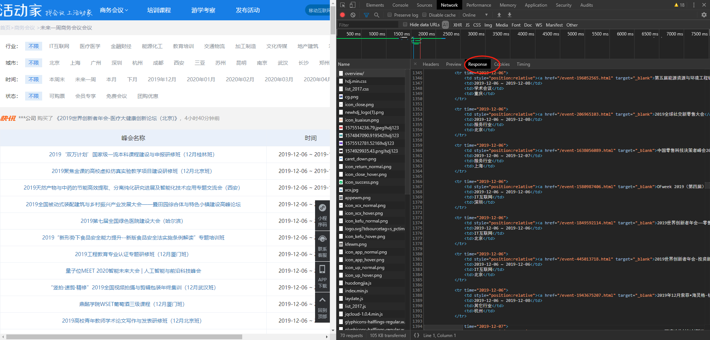
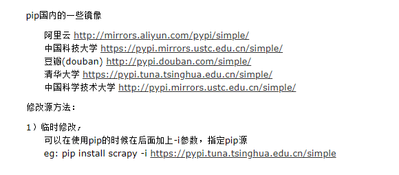
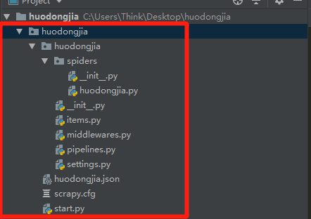
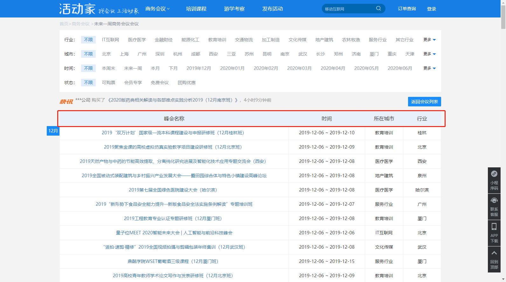

# 使用说明
## 项目说明
这是一个使用**scrapy**框架爬取活动家网站的项目

活动家网站：
https://www.huodongjia.com/

项目的需求：
需要从网站上拿下来下周全国范围内即将举办的一些活动
 
## 需求分析
首先这肯定是一个爬虫项目。
然后确定爬的网址，因为我需要的是下周的数据。所以具体的网址应该是：

https://www.huodongjia.com/business/17/overview/

可以看到这只是第一页，总共有三页，后续的网页跳转仍然需要分析

其次使用什么样的方法来往下爬。

1、普通的发请求urllib.request，这个方法都用烂了。但是好像对这个网站没用。具体的情况就是：



可以看到网页里面想爬取的数据都是通过网页的Html来返回的。



所以我们首先会采用直接发请求的方法来得到返回值，但是经过尝试，此路不通。不再赘述。

2、当手足无措的时候，能救你的永远是Selenium.

这一部分，有兴趣的可以自己去查一下。除了慢点，占内存大点，没有说明缺点。


3、令我无限惊奇的**Scrapy**框架，爬静态网页，只能用两个字来形容：牛逼

但是这个框架对初级入门Python的小伙伴来讲，可能比较吃力，比如下面几个概念：

- 类成员
- 继承
- 装饰器
- 生成器
- Lamada
- 回调函数
- 不限于上述的概念


## scrapy框架简介
先放**Scrapy**的官网：https://scrapy.org/

然后放上中国人自己Scrapy的一个论坛型网站：http://www.scrapyd.cn/

接下来，就是用它了：

安装，有一百种安装的方法，看你自己的环境和需求，pip？pycharm Virtualenv？conda?

不再多言了，这里说一下如果官方的源比较慢的话，建议使用国内源。百度Python国内源就行。网速很美妙。




## 项目开发
这一步创建项目了。这个框架好是好，但是个人觉得并不够轻量。算是一个大项目了。



所以听我的，用它吧：


不要再跟我说vscode有多好了，软文瞎吹多少，不如自己一用就知道。以后有时间我出个对比。

### 创建scrapy项目

安装好安装好scrapy类库之后，就可以创建scrapy项目了，pycharm不能直接创建scrapy项目，
必须通过命令行创建，打开pycharm的Terminal终端，输入**scrapy startproject huodongjia**
命令，就可以创建名为huodongjia的scrapy项目。

然后在pycharm的项目空间中就可以看到huodongjia项目的目录结构,结构的图在前文中已经展示。


然后新建一个start的py文件，里面的代码如下：

```python
#这是主函数部分
from scrapy import  cmdline
cmdline.execute("scrapy crawl huodongjia".split())
```
为什么要这么操作呢，是因为scrapy框架不能直接调试和运行，必须在目录内使用scrapy的一些命令进行调试和运行。
相关的全局和局部命令参看官网，本文目的在于介绍项目，进一步的知识浅尝辄止即可。

后续的代码写好之后，运行只需要运行本文件即可。类似于C#和C中主函数的意思。


## 开始写主体部分的代码

scrapy项目的写法和平常的爬虫项目写法不一样，但是很符合逻辑上的流程。

1、我需要的是这个表中的这四个字段



所以，直接在item中写如下的代码，即可：

```python
import scrapy
class HuodongjiaItem(scrapy.Item):
    # define the fields for your item here like:
    # name = scrapy.Field()
    meeting=scrapy.Field()#会议名字段
    date=scrapy.Field()#日期字段
    place=scrapy.Field()#地点字段
    industry=scrapy.Field()#行业字段
    pass
```

写完上述的代码之后，并不是在运行项目的时候，这部分的代码字段需要pipline通道进行处理和爬取。需要在setting.py文件中激活pipline的
这个组件（官方的说法，我也不知道应该怎么说）
```python
ITEM_PIPELINES = {
   'huodongjia.pipelines.HuodongjiaPipeline': 300,#数字的大小代表的是存在多个通道时，先后被执行的顺序
}
```

这部分代码本来是被注释掉的，需要人为取消注释，然后修改


2、然后是我需要从活动家的这个网站上去拿数据

就需要开始写spider的主体部分，在spiders路径下，新建一个py文件，写爬虫的主体部分
名字随意，不一定要和项目名字一样

```python
import scrapy

from huodongjia.items import HuodongjiaItem
class HuodongjiaSpuder(scrapy.Spider):
    name = "huodongjia"#name of spider
    start_urls=["https://www.huodongjia.com/business/17/overview/page-1"]#innitial url 
    base_url="https://www.huodongjia.com/business/17/overview/"# basic url 
    offset=0 #偏移量
    def parse(self, response):
        item=HuodongjiaItem()
        item["meeting"]=response.xpath("//*[@id=\"event-infos-table\"]/tbody/tr/td[1]/a/text()").extract()
        item["date"]=response.xpath("//*[@id=\"event-infos-table\"]/tbody/tr/@time").extract()
        item["industry"]=response.xpath("//*[@id=\"event-infos-table\"]/tbody/tr/td[3]/text()").extract()
        item["place"]=response.xpath("//*[@id=\"event-infos-table\"]/tbody/tr/td[4]/text()").extract()
        yield item
        #假设有1000页
        if self.offset<1000:
            self.offset+=1
            url=self.base_url+"page-{0}".format(str(self.offset))
            print(url)
            yield scrapy.Request(url,callback=self.parse)

```

这里主要说一下几个坑，有几个概念是scrapy中预设好的。比如start_urls是和默认的parse函数对应的。
当然也可以不用像上面那么写，可以麻烦一点，把所有的url放进一个列表里面循环发请求即可，本文是为了学习
scrapy框架，所以才这么写的。也就是说parse函数会自己先调用start_urls中的网址进行访问。然后剩下的网址交给了
scrapy.Request(url,callback=self.parse)，并且指定回调函数是parse来进行处理，每次parse都是一个新的item对象


上面的response中需要信息提取采取的是Xpath，这里不再详述。


3、将每次访问得到的item对象进行清洗并储存

在pipline.py中的代码如下：

```python
 import pandas as pd
import datetime


class HuodongjiaPipeline(object):
    def __init__(self):
        self.df = pd.DataFrame(columns=["会议", "日期", "地点", "行业"])

    def process_item(self, item, spider):
        
        ## 删除每一次爬取的表头
        item['date'] = item['date'][:]
        item['place'] = item['place'][1:]
        item['industry'] = item['industry'][1:]
        df_temp = pd.DataFrame({"会议": item['meeting'],
                                "日期": item['date'],
                                "地点": item['place'],
                                "行业": item['industry']})
        self.df = self.df.append(df_temp)
        self.df["日期"] = pd.to_datetime(self.df["日期"])  # 将日期的字符串转为日期格式
        self.df = self.df[(self.df["日期"] >= self.get_next_week()[0]) & (
            self.df["日期"] <= self.get_next_week()[1])]  # 筛选出本下周的活动
        if len(df_temp) == 0:
            spider.crawler.engine.close_spider(spider)

        ## 将日期类型转为字符串，否则excel打开之后会自动变为yyyy-mm-dd hh-mm-ss
        self.df["日期"] = self.df["日期"].apply(lambda x: x.strftime('%Y-%m-%d'))
        self.df.to_excel(
            f"{str(self.get_next_week()[0])}~{str(self.get_next_week()[1])}_huodongjia.xlsx",
            index=0,
            encoding='gb2312')
        return item

    def get_next_week(self):
        monday, sunday = datetime.date.today(), datetime.date.today()
        one_day = datetime.timedelta(days=1)
        seven_days = datetime.timedelta(days=7)
        while monday.weekday() != 0:
            monday -= one_day
        while sunday.weekday() != 6:
            sunday += one_day
        # 返回当前的星期一和星期天的日期
        return monday + seven_days, sunday + seven_days
```

代码比较简单，这里主要讲几个需要注意的地方：
- 下一周周一和周日的获得方法
- 主动触发关闭scrapy的方法，前面是假设有1000个网页，按实际上只有3页，所以当返回值为空的时候，就可以主动触发关闭
- DataFrame中的日期格式我问题，不经过调整的话，excel中默认会加上时分秒，所以转为字符串。


setting文件中的相关设置，参见如下的网址：https://blog.csdn.net/xc_zhou/article/details/82760608

本项目中主要设置了：
```python
BOT_NAME = 'huodongjia'

SPIDER_MODULES = ['huodongjia.spiders']#scrapy即将导入的库的列表
NEWSPIDER_MODULE = 'huodongjia.spiders'
ROBOTSTXT_OBEY = False
DEFAULT_REQUEST_HEADERS = {
  'Accept': 'text/html,application/xhtml+xml,application/xml;q=0.9,image/webp,image/apng,*/*;q=0.8,application/signed-exchange;v=b3',
  'Accept-Language': 'zh-CN,zh;q=0.9',
  'User-Agent':'Mozilla/5.0 (Windows NT 10.0; Win64; x64) AppleWebKit/537.36 (KHTML, like Gecko) Chrome/78.0.3904.108 Safari/537.36'
}#模拟浏览器

ITEM_PIPELINES = {
   'huodongjia.pipelines.HuodongjiaPipeline': 300,#数字的大小代表的是存在多个通道时，先后被执行的顺序
}

LOG_LEVEL = 'ERROR'
```


